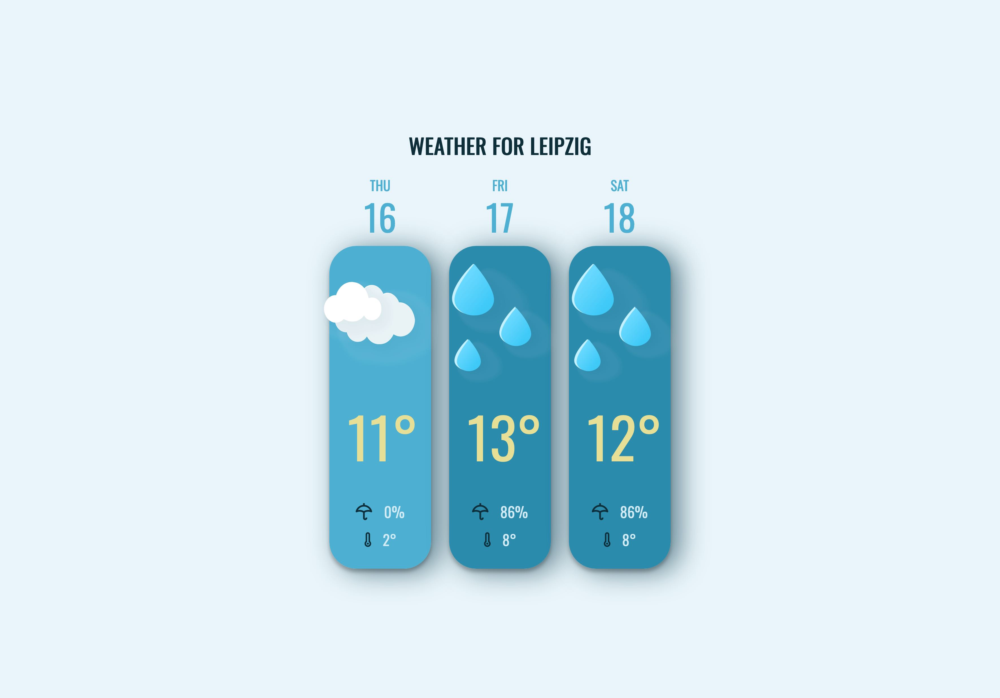

# Advent of CSS/JS 8: Weather

A simple web app based on an Advent of [CSS](https://www.adventofcss.com)/[JS](https://www.adventofjs.com) challenge displaying current weather data for your location.

Uses React's Context/Reducer pattern, a custom data fetching Hook, and dynamic imports.

[Deployed here](https://panypticon.github.io/advent2022-8-weather/)

